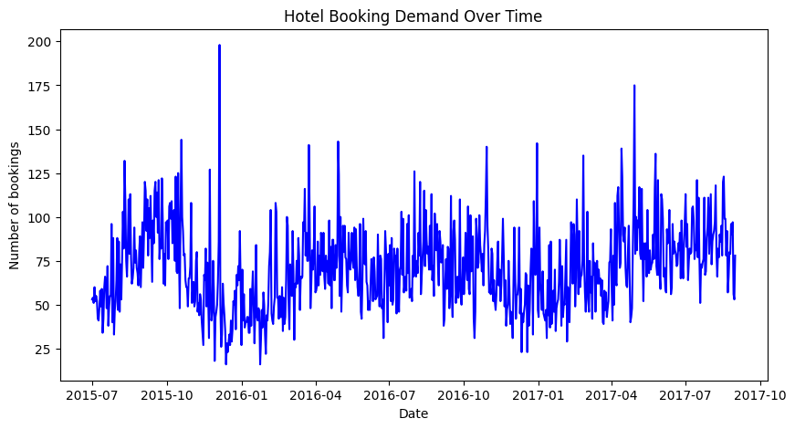
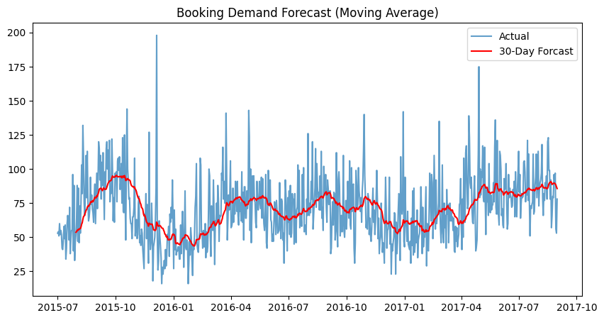

# 📈 Hotel Booking Demand Forecasting (Time Series Analysis)

This project focuses on **analyzing and forecasting hotel booking demand over time** using time series techniques.  
By visualizing historical booking patterns and applying a moving average forecast, the project highlights how data can be used to support **demand planning and decision-making** in the hospitality domain.

---

## 📌 Project Overview

Understanding booking trends is critical for hotels to manage capacity, pricing, and staffing.  
In this project, I performed **time series analysis** on a real-world Kaggle dataset to:

- Analyze daily hotel booking trends
- Visualize demand fluctuations over time
- Forecast future booking demand using a rolling window approach

The project emphasizes **clarity, visualization, and business relevance** rather than complex modeling.

---

## 📊 Dataset

- **Source:** Kaggle – Hotel Booking Demand Dataset  
- **Domain:** Hospitality / Travel Analytics  
- **Data Type:** Time series (daily bookings)

---

## 🛠️ Tech Stack

- Python  
- Pandas  
- Matplotlib  
- Google Colab  

---

## ⚙️ Methodology

1. Loaded and prepared hotel booking data  
2. Created a unified date field from arrival date columns  
3. Aggregated daily booking counts  
4. Visualized historical booking demand  
5. Applied a **30-day moving average** to forecast demand trends  

---

## 📈 Visualizations

### 1️⃣ Hotel Booking Demand Over Time
This visualization shows how booking volume changes across time, helping identify overall trends and fluctuations.

---

### 2️⃣ Booking Demand Forecast (Moving Average)
A rolling 30-day moving average is applied to smooth short-term fluctuations and highlight long-term demand trends.

---

## 🧠 Key Insights

- Booking demand shows clear temporal variation
- Moving averages help reduce noise and reveal underlying trends
- Time series analysis provides actionable insights for demand planning

---

## 🚀 Future Enhancements

- Seasonal decomposition
- Advanced forecasting models (ARIMA / SARIMA)
- Power BI dashboard integration
- Comparison of multiple forecasting windows

---

## 📎 Use Case

This project demonstrates how **time series analysis** can be applied to real-world business data to support forecasting, planning, and data-driven decision-making.

---

## 📬 Author

**Athulya B Vijay**  
Data Analyst | Python | Time Series Analysis  

GitHub: https://github.com/athulyaesther777  
